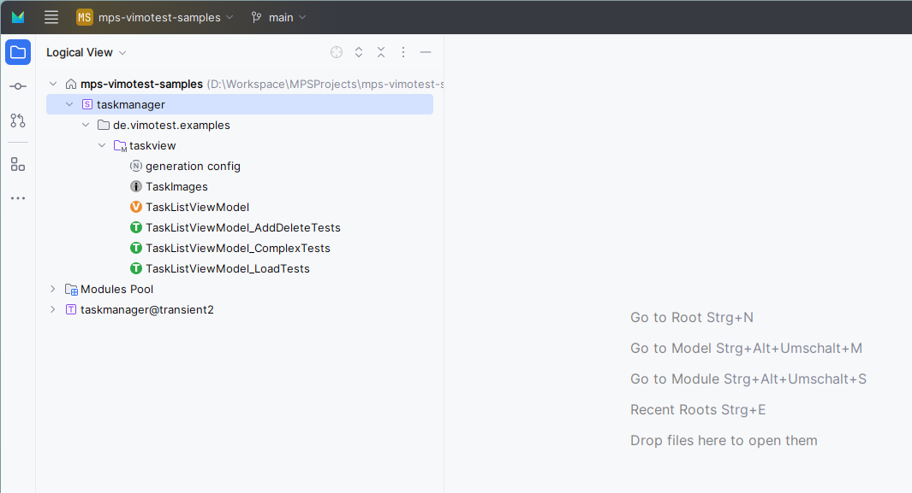

# ViMoTest Samples

This repository contains sample projects for the ViMoTest language.

## Getting Started

## Setup Option 1: Via Gradle

* ensure you use Java 20 (required by Gradle 8.2)
* execute `gradlew openProjectInMps` (Windows), `./gradlew openProjectInMps` (MacOS/Linux)
  * this downloads MPS for your current OS and creates an executable installation in `build/mps-bundle`
  * Windows: executes `build/mps-bundle/mps/bin/mps.bat`
  * MacOS: executes `build/mps-bundle/Contents/MacOS/mps`
* usually the procedure takes about 2-5 min.
* then, when MPS has opened, the project is ready
  * if you observe a "No project was found to open the file in" error, simply try it again

## Setup Option 2: Download ViMoTest MPS Bundle

* download the MPS bundle for your operating system from TODO
  * Windows: vimotest-mps-bundle-windows-x64
  * MacOS
    * Silicon: vimotest-mps-bundle-osx-aarch64
    * Intel: vimotest-mps-bundle-osx-x64
    * Important: MacOS will not allow to run the downloaded application, because it is not signed, you can allow it by executing the following command in the terminal: `xattr -dr com.apple.quarantine /path/to/extracted/Contents`
  * Linux: vimotest-mps-bundle-linux-x64
* extract the downloaded ZIP and start MPS
  * Windows/Linus: `bin/mps.bat`
  * MacOS: `Contents/MacOS/mps`

## Import the sample projects

* open this `mps-vimotest-samples` repository as project in MPS
  * 
  * to generate: in menu `Build`/`Make Project`, or right click on the module `taskmanager` and select `Make Solution`
  * generated sources are in the `solutions/taskmanager/source_gen` folder
* (optionally): switch to light theme in MPS under `Settings`/`Appearance & Behavior`/`Appearance`/`Theme`/`IntelliJ Light`

## Task Manager

The first sample project is a simple task manager application.

See: [Task Manager Example](taskmanager/Readme.md)
