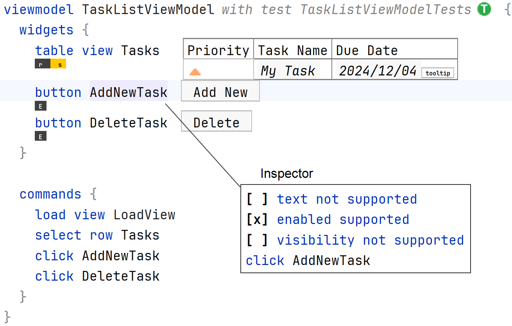
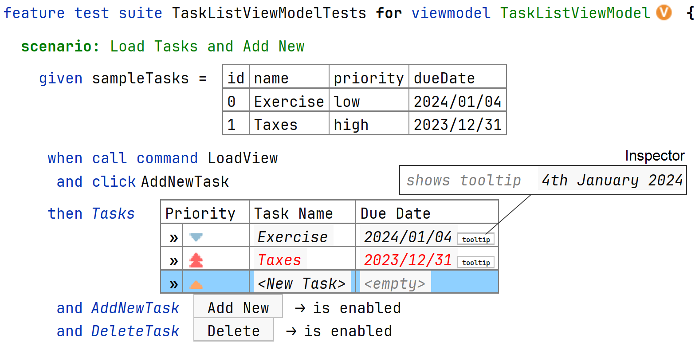

# ViMoTest Samples

This repository contains sample projects for the ViMoTest language.

## Task Manager

The JavaFX implementation project for the simple task manager application can be found in the subdirectory `taskmanager`.
There is a gradle task `copyGeneratedSources` in the sub-project to copy the generated sources from `solutions/taskmanager/source_gen` to the local `src/taskmanager/generated` folder, where it is integrated to the taskmanager build process.

See: [Task Manager Example](taskmanager/Readme.md)

## Getting Started

## Setup Option 1: Via Gradle

* ensure you use Java 20 (required by Gradle 8.2)
* execute `gradlew openProjectInMps` (Windows), `./gradlew openProjectInMps` (MacOS/Linux)
  * this downloads MPS for your current OS and creates an executable installation in `build/mps-bundle`
  * Windows: executes `build/mps-bundle/mps/bin/mps.bat`
  * MacOS: executes `build/mps-bundle/Contents/MacOS/mps`
* usually the procedure takes about 2-5 min.
* then, when MPS has opened, the project is ready
  * if you observe a "No project was found to open the file in" error, simply try it again

## Setup Option 2: Install MPS Manually

* download MPS 2024.1.1 from https://www.jetbrains.com/mps/download/
* download `vimotest-plugins-all.zip` from the latest release: https://github.com/vimotest/mps-vimotest/releases/latest
* extract the downloaded ZIP, such that there are three ZIPs in the folder
  * `mps-vimotest.zip`, `alfi.zip`, `CppBaseLanguage.zip`
* start MPS and install the plugins via `Settings`/`Plugins`/`Install Plugin from Disk...`
  * select sequentially the three ZIPs in this order: `CppBaseLanguage.zip`, `alfi.zip`, `mps-vimotest.zip`
  * restart MPS

## Setup Option 3: Download ViMoTest MPS Bundle

* download the MPS bundle for your operating system from the latest release: https://github.com/vimotest/mps-vimotest/releases/latest
  * Windows: `vimotest-mps-bundle-windows-x64.zip`
  * MacOS
    * Silicon: `vimotest-mps-bundle-osx-aarch64.zip`
    * Intel: `vimotest-mps-bundle-osx-x64.zip`
    * Important: MacOS will not allow to run the downloaded application, because it is not signed, you can allow it by executing the following command in the terminal: `xattr -dr com.apple.quarantine /path/to/extracted/Contents`
  * Linux: `vimotest-mps-bundle-linux-x64.zip`
* extract the downloaded ZIP and start MPS
  * Windows/Linus: `bin/mps.bat`
  * MacOS: `Contents/MacOS/mps`

## Import the sample projects

* open this `mps-vimotest-samples` repository as project in MPS
  * 
  * to generate: in menu `Build`/`Make Project`, or right click on the module `taskmanager` and select `Make Solution`
  * generated sources are in the `solutions/taskmanager/source_gen` folder
* (optionally): switch to light theme in MPS under `Settings`/`Appearance & Behavior`/`Appearance`/`Theme`/`IntelliJ Light`
