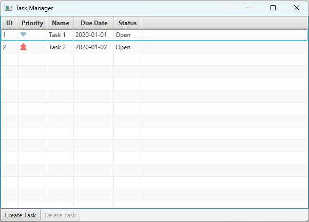

# Task Manager Example

This small JavaFX project is used to demonstrate ViMoTest with a simple GUI consisting of a list of tasks, a create task button and a delete button.

It is intentionally no complete task manager application.

## Start the application

Run `gradlew run` to start the JavaFX application.

## Copy files from ViMoTest

* Follow the instructions in the root README.md to generate sources into `solutions/taskmanager/source_gen`
* In this `taskmanager` project, run `gradlew check` which internally copies the generated files, compiles and runs the tests

Note: we checked-in the generated files, such that the project can be demonstrated and the solution can be analyzed without the need to generate the files.
